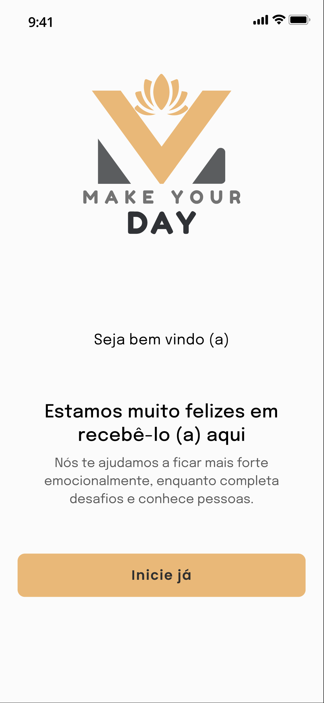
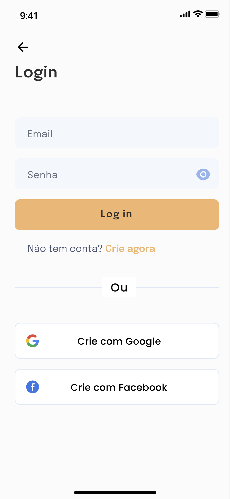
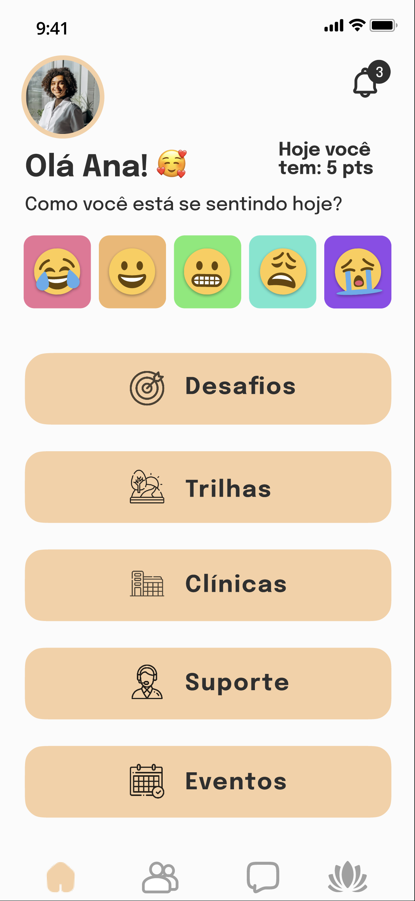

# Projeto MYD (Make Your Day)

 

# Sobre o projeto

https://www.figma.com/proto/TRpkdDpCtbnSBY5s4h9TTd/resid%C3%AAncia-nav-V2?type=design&node-id=111-1185&t=gnPy9vblEPzZKAz5-1&scaling=min-zoom&page-id=0%3A1&starting-point-node-id=111%3A1185&mode=design

O projeto MYD é uma aplicativo construído durante a residência do  Embarque Digital (programa da prefeitura de recife em parceria com o Porto digital).

A plataforma se propõe a ajudar pessoas a lidarem melhor com ansiedade e depressão, através da criação de desafios diários e rotina, alinhados a uma vida saudável de forma gamificada e promovendo a interação e suporte emocional dos usuários

## Layout 
  
  

# Autores

Lucas carneiro de lima, Ana Cecília Simões Chalegre, Arthur Marques, Guilherme França, Hallan Victor Pereira de Almeida, Helder Bernardo dos Santos Junior, Rodrigo Argolo Carvalho Miranda, Salmo Thélio de Souza, Victor Costa Medeiros, Vinicius da Silva Grillo.

https://www.linkedin.com/in/lucas-carneiro-790500262/

 
